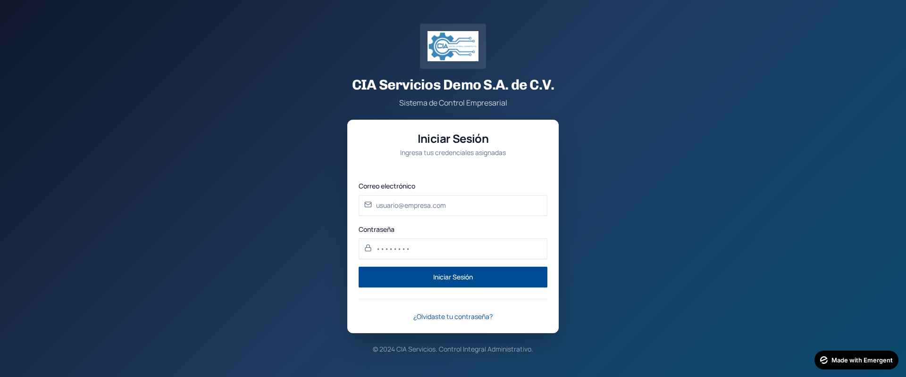
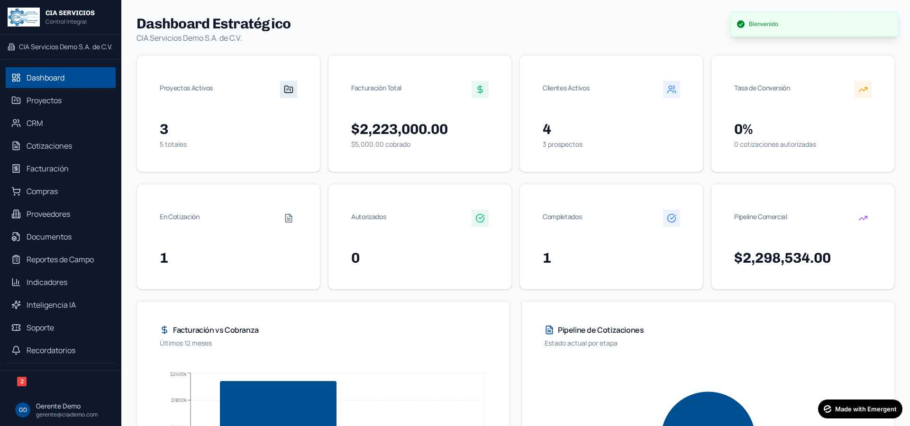
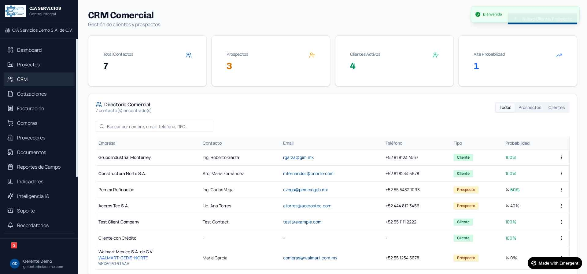
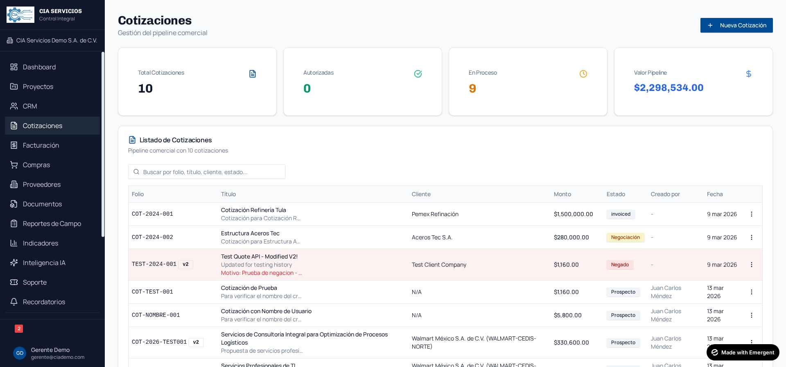
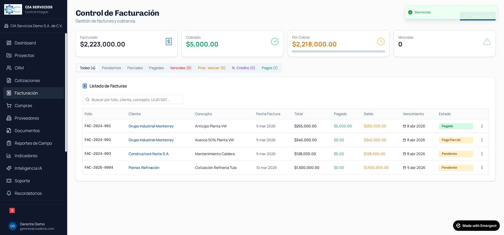
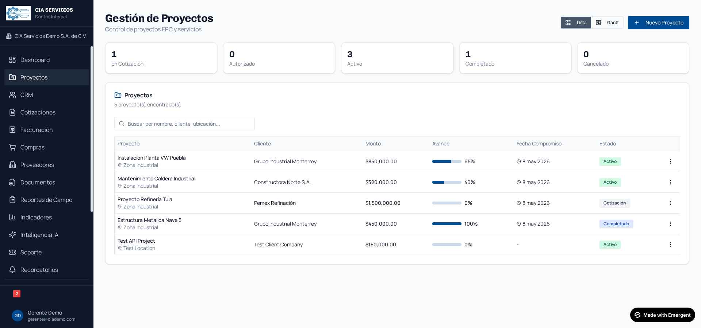
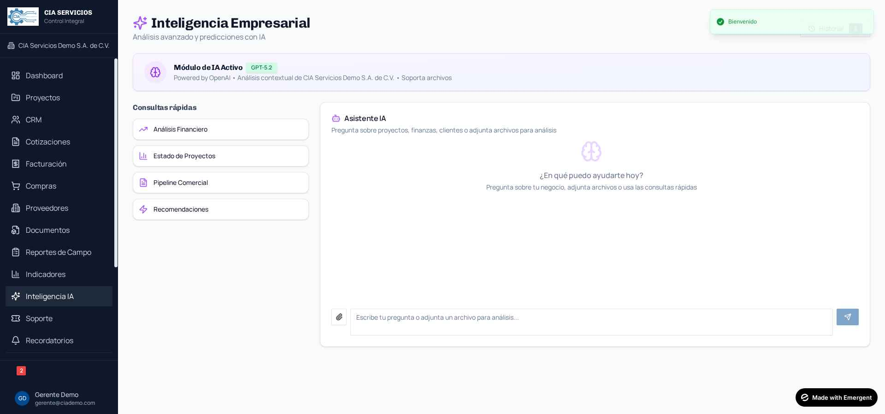
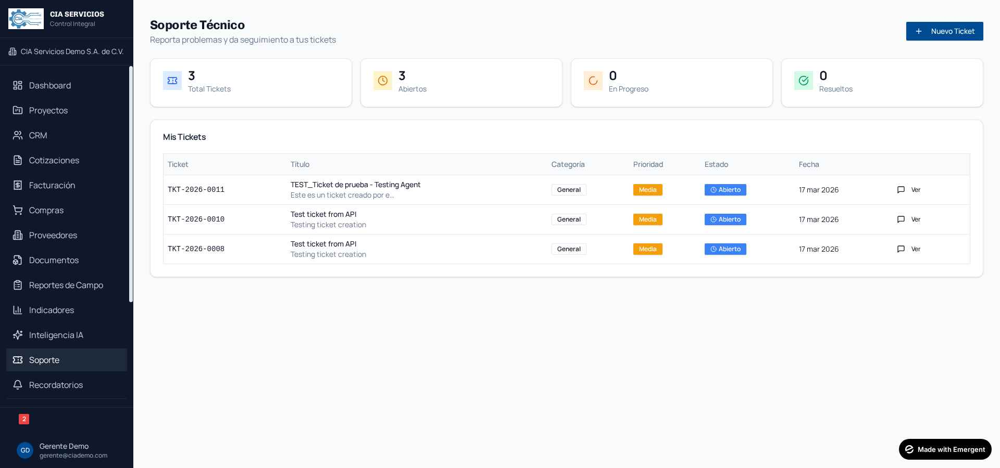
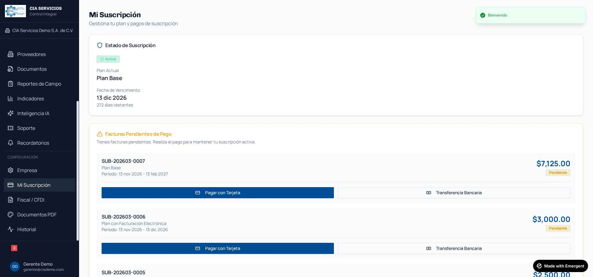

# Primeros Pasos para Empresas - CIA SERVICIOS

## Guía Visual con Capturas de Pantalla

Bienvenido a **CIA SERVICIOS - Control Integral**. Esta guía te ayudará a configurar tu empresa y comenzar a usar la plataforma.

---

## Índice

1. [Acceso a tu Portal](#1-acceso-a-tu-portal)
2. [Dashboard Estratégico](#2-dashboard-estratégico)
3. [Gestión de Clientes (CRM)](#3-gestión-de-clientes-crm)
4. [Cotizaciones](#4-cotizaciones)
5. [Control de Facturación](#5-control-de-facturación)
6. [Gestión de Proyectos](#6-gestión-de-proyectos)
7. [Inteligencia IA](#7-inteligencia-ia)
8. [Soporte Técnico](#8-soporte-técnico)
9. [Tu Suscripción](#9-tu-suscripción)
10. [Primeros Pasos Recomendados](#10-primeros-pasos-recomendados)

---

## 1. Acceso a tu Portal

### URL de Acceso
Tu portal empresarial está disponible en:
```
https://[dominio]/empresa/[slug-de-tu-empresa]/login
```

El **slug** es un identificador único basado en el nombre de tu empresa (ejemplo: `mi-empresa-sa-de-cv`).

### Pantalla de Login



**Instrucciones:**
1. Ingresa con el email de administrador que te proporcionaron
2. Usa la contraseña temporal que recibiste
3. **Importante:** Te recomendamos cambiar la contraseña después del primer acceso
4. Si olvidaste tu contraseña, haz clic en "¿Olvidaste tu contraseña?"

---

## 2. Dashboard Estratégico

Al iniciar sesión, serás dirigido al Dashboard Estratégico, tu centro de control.



### Indicadores Principales (KPIs)

| Indicador | Descripción |
|-----------|-------------|
| **Proyectos Activos** | Número de proyectos en curso |
| **Facturación Total** | Monto total facturado y cobrado |
| **Clientes Activos** | Total de clientes en tu cartera |
| **Tasa de Conversión** | Porcentaje de cotizaciones autorizadas |

### Widgets Inferiores
- **Facturación vs Cobranza**: Gráfico de barras comparativo de los últimos 12 meses
- **Pipeline de Cotizaciones**: Estado actual de tu embudo de ventas

---

## 3. Gestión de Clientes (CRM)

El módulo CRM te permite gestionar tu cartera de clientes y prospectos.



### Funcionalidades

**Directorio Comercial:**
- Lista completa de todos tus contactos
- Filtros por tipo: Todos, Prospectos, Clientes
- Búsqueda por nombre, email, teléfono o RFC

**Información por Contacto:**
- Empresa y nombre de contacto
- Email y teléfono
- Tipo (Cliente/Prospecto)
- Probabilidad de cierre

**Acciones Disponibles:**
- Crear nuevo cliente
- Editar información
- Ver estado de cuenta
- Programar seguimientos (llamadas, visitas, reuniones)

---

## 4. Cotizaciones

Gestiona tu pipeline comercial con cotizaciones profesionales.



### Pipeline de Ventas

| Estado | Descripción |
|--------|-------------|
| **Prospecto** | Cotización inicial en proceso |
| **Negociación** | En revisión con el cliente |
| **Autorizada** | Cliente aprobó la cotización |
| **Facturada** | Ya se convirtió en factura |
| **Negada** | Cliente rechazó la propuesta |

### Crear Nueva Cotización
1. Haz clic en **"+ Nueva Cotización"** (botón azul superior)
2. Selecciona el cliente
3. Agrega productos/servicios con precios
4. El sistema calcula subtotal, IVA y total automáticamente
5. Genera PDF para enviar al cliente

### Convertir a Factura
Una vez que la cotización esté autorizada, puedes convertirla a factura con un solo clic desde el menú de acciones.

---

## 5. Control de Facturación

Gestiona facturas, pagos y cobranza de manera eficiente.



### Resumen Superior
- **Facturado**: Total de facturas emitidas
- **Cobrado**: Monto total recibido
- **Por Cobrar**: Saldo pendiente de clientes
- **Vencidas**: Facturas que pasaron su fecha de vencimiento

### Pestañas de Filtro
- **Todas**: Vista completa
- **Pendientes**: Facturas sin pago
- **Parciales**: Con abonos parciales
- **Pagadas**: Completamente liquidadas
- **Vencidas**: Requieren seguimiento urgente
- **Próx. Vencer**: Para gestión proactiva

### Acciones por Factura
- Registrar abonos (pagos parciales o totales)
- Timbrar CFDI (si tienes plan con facturación)
- Subir factura SAT (XML/PDF externo)
- Ver estado de cuenta del cliente

---

## 6. Gestión de Proyectos

Control y seguimiento de obras, servicios y proyectos.



### Vistas Disponibles
- **Vista Lista**: Tabla con información resumida (predeterminada)
- **Vista Gantt**: Diagrama de tiempos visual (clic en botón "Gantt")

### Información por Proyecto
- Nombre y ubicación
- Cliente asociado
- Monto total
- Porcentaje de avance (barra visual)
- Fecha compromiso
- Estado: En Cotización, Autorizado, Activo, Completado, Cancelado

### Crear Nuevo Proyecto
1. Clic en **"+ Nuevo Proyecto"**
2. Define nombre, cliente, ubicación y presupuesto
3. Establece fechas de inicio y compromiso
4. Agrega tareas con tiempos y costos estimados

---

## 7. Inteligencia IA

Asistente empresarial con inteligencia artificial para análisis y recomendaciones.



### Consultas Rápidas
- **Análisis Financiero**: Insights sobre facturación y cobranza
- **Estado de Proyectos**: Resumen y recomendaciones
- **Pipeline Comercial**: Análisis de cotizaciones
- **Recomendaciones**: Sugerencias para mejorar tu negocio

### Funcionalidades
- Chat conversacional en español
- Carga de archivos (PDF, Excel, imágenes) para análisis
- Guardar y retomar conversaciones anteriores
- Historial de consultas

### Ejemplo de Uso
Pregunta: *"¿Cuál es el estado de mi cobranza este mes?"*
Respuesta: La IA analizará tus datos y te dará un resumen con recomendaciones.

---

## 8. Soporte Técnico

Sistema de tickets para reportar problemas o solicitar ayuda.



### Dashboard de Tickets
- **Total Tickets**: Todas tus solicitudes
- **Abiertos**: Pendientes de atención
- **En Progreso**: Siendo trabajados por soporte
- **Resueltos**: Completados

### Crear Nuevo Ticket
1. Clic en **"+ Nuevo Ticket"**
2. Ingresa título descriptivo
3. Selecciona categoría (General, Técnico, Facturación, etc.)
4. Define prioridad
5. Describe el problema detalladamente
6. Adjunta capturas de pantalla si es necesario

### Tiempos de Respuesta
| Prioridad | Tiempo Máximo |
|-----------|---------------|
| **Alta** | 4 horas |
| **Media** | 24 horas |
| **Baja** | 48 horas |

---

## 9. Tu Suscripción

Gestiona tu plan y realiza pagos de renovación.



### Estado de Suscripción
- **Plan Actual**: Plan Base o Plan con Facturación Electrónica
- **Estado**: Activa, Pendiente o Suspendida
- **Fecha de Vencimiento**: Cuándo termina tu período actual
- **Días Restantes**: Cuenta regresiva

### Planes Disponibles

| Plan | Precio Mensual | Incluye |
|------|----------------|---------|
| **Plan Base** | $2,500 MXN | Todos los módulos (sin CFDI) |
| **Plan con Facturación** | $3,000 MXN | Todo + timbrado CFDI ilimitado |

### Descuentos por Período
- **Trimestral**: 5% descuento
- **Semestral**: 10% descuento
- **Anual**: 15% descuento

### Formas de Pago

**Opción 1: Pago con Tarjeta**
1. Localiza tu factura pendiente
2. Haz clic en **"Pagar con Tarjeta"**
3. Serás redirigido a Stripe (plataforma segura)
4. Ingresa los datos de tu tarjeta
5. Tu suscripción se activa inmediatamente

**Opción 2: Transferencia Bancaria**
1. Haz clic en **"Transferencia Bancaria"**
2. Copia los datos de la cuenta bancaria
3. Realiza la transferencia desde tu banco
4. Envía tu comprobante al soporte
5. Tu suscripción se activa al verificar el pago

---

## 10. Primeros Pasos Recomendados

### Checklist de Inicio

- [ ] **Iniciar sesión** con tus credenciales
- [ ] **Cambiar contraseña** por una segura
- [ ] **Completar datos fiscales** de tu empresa (Configuración > Empresa)
- [ ] **Subir tu logo** (aparecerá en cotizaciones y facturas)
- [ ] **Crear usuarios** para tu equipo (si aplica)
- [ ] **Registrar primeros clientes** en el CRM
- [ ] **Crear primera cotización** de prueba
- [ ] **Verificar tu suscripción** y fechas de pago

### Consejos Pro

> **💡 Tip 1**: Usa la Inteligencia IA para obtener análisis rápidos de tu negocio.

> **💡 Tip 2**: Configura seguimientos en el CRM para no olvidar llamadas importantes.

> **💡 Tip 3**: Revisa el dashboard diariamente para mantener el control de tu operación.

> **💡 Tip 4**: Activa las notificaciones para recibir alertas de facturas vencidas.

---

## Navegación del Sistema

### Menú Lateral (Sidebar)
El menú lateral te permite acceder a todos los módulos:
- Dashboard
- Proyectos
- CRM
- Cotizaciones
- Facturación
- Compras
- Proveedores
- Documentos
- Reportes de Campo
- Indicadores
- Inteligencia IA
- Soporte
- Recordatorios
- **Configuración** (solo admins)
- **Mi Suscripción** (solo admins)

### Barra Superior
- **Campana de notificaciones**: Alertas y recordatorios
- **Perfil de usuario**: Configuración personal y cerrar sesión

---

## Preguntas Frecuentes

### ¿Cómo cambio mi contraseña?
Ve a tu perfil (esquina inferior izquierda) > Configuración de cuenta

### ¿Puedo usar el sistema en mi celular?
Sí, la plataforma es responsiva y funciona en dispositivos móviles.

### ¿Mis datos están seguros?
Sí, usamos encriptación SSL y backups diarios de la base de datos.

### ¿Qué pasa si vence mi suscripción?
Tendrás un período de gracia de 5 días. Después, el acceso se suspenderá hasta regularizar el pago. Tus datos permanecen seguros.

### ¿Cómo contacto a soporte?
- Desde el módulo de **Soporte** (crear ticket)
- Email: soporte@cia-servicios.com

---

## Contacto

**CIA SERVICIOS - Control Integral**
- Email: soporte@cia-servicios.com
- Horario: Lunes a Viernes, 9:00 - 18:00

---

*¡Bienvenido a CIA SERVICIOS!*
*Estamos aquí para ayudarte a crecer tu negocio.*

---

*Última actualización: Marzo 2026*
*Versión del documento: 2.0*
